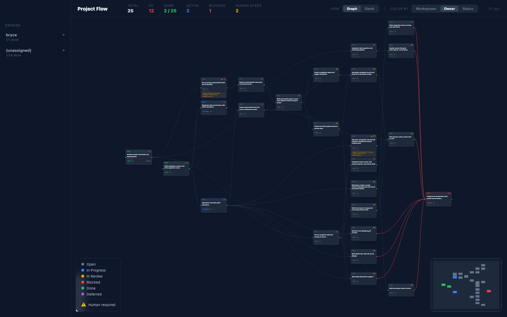
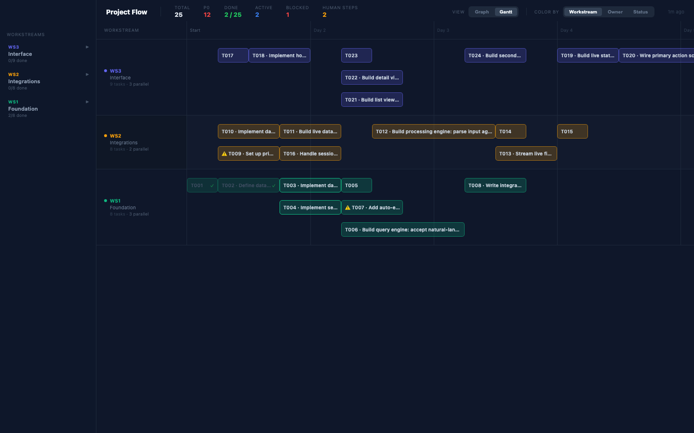
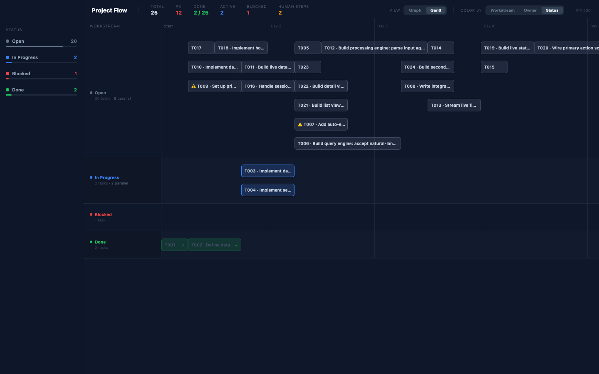

# beads-render

Live browser dashboard for [BEADS](https://github.com/gastownhall/beads) task graphs. Reads task status exclusively from BEADS and renders a dependency graph and Gantt chart with inline editing.

---

## Requirements

- Node 22+
- Python 3.11+
- [bd (beads)](https://github.com/gastownhall/beads) — task tracker CLI

## Quickstart

```sh
./setup.sh           # install deps, verify requirements, generate initial data
./render.py          # generate data + open dev server at localhost:5173
./render.py --data   # generate data file only (no server)
```

Writes two data files:
- `src/generated/tasks.ts` — used by the Vite dev server
- `public/tasks.json` — fetched at runtime by the built app

---

## Dev mode (with task editing)

Task editing requires the Python server running alongside Vite (Vite proxies `POST /task/update` to `:8080`). Use the convenience script to start both:

```sh
./dev.sh
```

Or manually in two terminals:

```sh
# Terminal 1
./render.py --data
python3 server.py --port 8080

# Terminal 2
npm run dev
```

---

## Production (static server + live updates)

Build once, then run the server:

```sh
npm run build
python3 server.py --port 8080 --secret YOUR_WEBHOOK_SECRET
```

The server:
- Serves the built `dist/` as static files
- Intercepts `GET /tasks.json` directly from `public/tasks.json` (always fresh)
- Handles `POST /webhook` — runs `bd dolt pull && python render.py --data` on each push event
- Handles `POST /task/update` — runs `bd update` and regenerates `tasks.json`

The browser polls `/tasks.json` every 30 seconds and rebuilds when `generatedAt` changes.

### GitHub webhook setup

In your repo: Settings → Webhooks → Add webhook:

| Field | Value |
|-------|-------|
| Payload URL | `https://your-host/webhook` |
| Content type | `application/json` |
| Secret | same value as `--secret` |
| Events | "Just the push event" |

Workers push task updates (`bd close <id> && bd dolt push && git push`), GitHub fires the webhook, and the dashboard updates within 30 seconds.

```sh
WEBHOOK_SECRET=your-secret PORT=8080 python3 server.py
```

---

## Team roster (`team.json`)

Create an optional `team.json` in your project root to guarantee team members appear in owner views even if they have no assigned tasks:

```json
["alice", "bob", "carol"]
```

Re-run `./render.py --data` after editing. Members with no tasks still get rows in the Gantt and options in the assignee dropdown.

---

## Render layouts

Two view modes (**Graph** and **Gantt**) × three color modes (**Workstream**, **Owner**, **Status**). The left sidebar always matches the active color mode. Click any node or Gantt bar to open the **Selection** panel for inline editing.

### Graph — Color by Workstream


Directed acyclic graph (dagre layout). Each node is colored by workstream. Expand a workstream in the sidebar to see scope, owner, assignees, and per-task progress. Hover to highlight all nodes in that workstream.

### Graph — Color by Owner



Nodes recolored by assignee. Sidebar lists owners with done/total counts, hours remaining, and workstream breakdown. `(unassigned)` row appears when any task has no assignee.

### Graph — Color by Status


Open (gray) · In Progress (blue) · In Review (amber) · Blocked (red) · Done (green) · Deferred (purple). Sidebar shows each group with task count and proportional fill bar. Tasks requiring human action are flagged ⚠️.

### Gantt — Color by Workstream



Horizontal timeline, one row per workstream. Bar position computed by topological longest-path scheduling — tasks start only after dependencies finish. Parallel tasks are packed into separate lanes with no overlap. Hover any bar for a tooltip.

### Gantt — Color by Owner


One row per owner. Team members from `team.json` get rows even with no tasks. Bottlenecks appear as deep stacks of lanes; parallelizable work fans out.

### Gantt — Color by Status



Timeline grouped by status bucket. Done tasks are dimmed with a ✓ badge; blocked tasks have a red border.

### Sidebar — Workstream expanded


Clicking a workstream expands it to show scope, owner, per-assignee breakdown, and progress bar. All nodes in that workstream highlight simultaneously.

### Sidebar — Status mode


Color-coded status groups with task counts and proportional fill bars.

---

## Inline task editing

Click any graph node or Gantt bar to open the **Selection** panel at the bottom of the sidebar. Editable fields:

| Field | Control |
|-------|---------|
| Status | Dropdown (open / in progress / in review / blocked / done / deferred) |
| Assignee | Dropdown of all known owners |
| Estimate | Text input (`2h`, `1d`, `1w`) — validated on save |
| Workstream | Dropdown of all workstreams |

Changes call `POST /task/update` → `bd update` → regenerate `tasks.json`. The UI reflects the update within ~1 second.

---

## File reference

| File | Purpose |
|------|---------|
| `render.py` | Generate data files from BEADS; optionally open dev server |
| `server.py` | Production static server + webhook handler + task update API |
| `dev.sh` | Start Python server + Vite dev server together |
| `public/tasks.json` | Runtime data file (generated, not committed) |
| `src/generated/tasks.ts` | Dev server data file (generated, not committed) |
